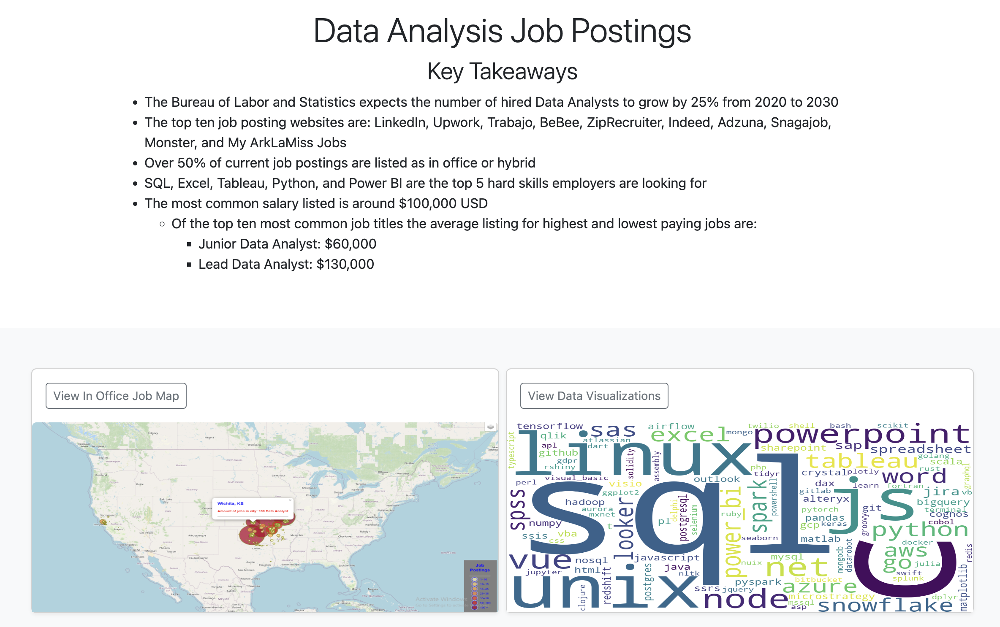
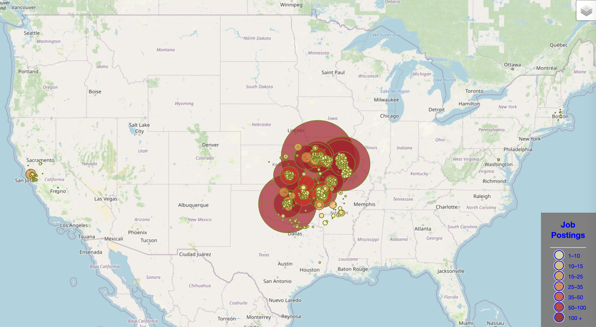
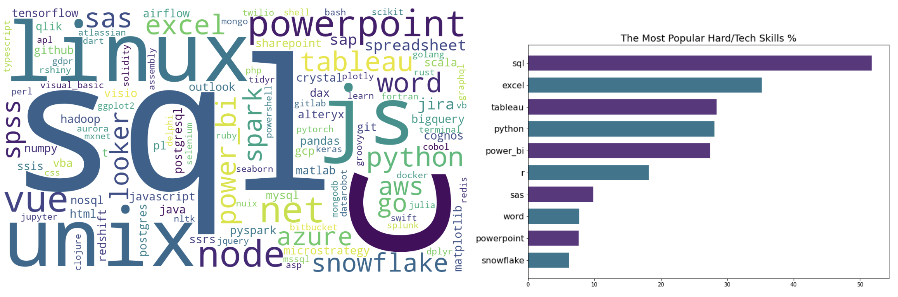

# Data Analytics Job Posting Analysis

## Project Description
This project seeks to analyze job postings for data analytics positions in order to identify insights such as salary, title of job, popular soft and hard skills, and location of jobs. A dataset from kaggle was utilized, which provided data for over 20,000 job positings at the time it was downloaded (6/12/23) from Google's job search results for Data Analyst positions in the United States. The data was downloaded from kaggle, cleaned and transformed into a `json` file, and leveraged `python` and `javascript` to create a web application with data visualizations.  

### Top-Level Directory Layout

    ├── data                    # datasource .csv from Kaggle and JSON files stored here for endpoints
    ├── notebooks               # production notebooks and files
    ├── static                  # static files for the application
    │   ├── css                 # CSS stylesheet code
    │   ├── images              # image files
    │   ├── js                  # javascript code
    ├── templates               # html files for use in the application
    └── README.md

----
## API KEY
- This project requires the use of a Google Cloud API key to gather latitude and longitude data for use in the Leaflet map. 
- A free account can be created here: https://cloud.google.com/free?_ga=2.110321741.-930793680.1686592668
- Once you have the API key, add it to the following file: 'notebooks/google_api_key.py'

----

## Application Website Overview
Below is an overview of the application website.

### Home 
The home page provides key takeaways from the project as well as links to a map and additional data visualizations. 
 

### In Office Job Map 
The Leaflet map highlights the location of job postings where the city and state are provided.  The markers show how many job postings are represented in that area.
There are a significant number of remote job postings that are not represented on the map.  
 

### Data Visualizations
The data visualizations includes charts, graphs, wordlouds, and even natural language processing from job descriptions.    
 

----

## Technical Specifications 
- **Datasource:**  Kaggle sourced .csv file (https://www.kaggle.com/datasets/lukebarousse/data-analyst-job-postings-google-search)
- **Web Server:** Flask - Micro web framework
- **Programming Language:** Python / JavaScript
- **Geographical Map:** Leaflet

----

## References/Resources

- **U.S Bureau of Labor Statistics** - https://www.bls.gov/ooh/math/operations-research-analysts.htm  
- **Forbes** - https://www.forbes.com/sites/bernhardschroeder/2021/06/11/the-data-analytics-profession-and-employment-is-exploding-three-trends-that-matter/?sh=489094073f81 
- **Bootstrap** - https://getbootstrap.com/

----
## Original Project
This project was originally completed as part of a Data Analytics Bootcamp with four teammates (Justin Bernier, Xuan Di, Tyler Levie, and John Quinn)
The original project can be found here: https://github.com/zarbin/UTA_Project-3